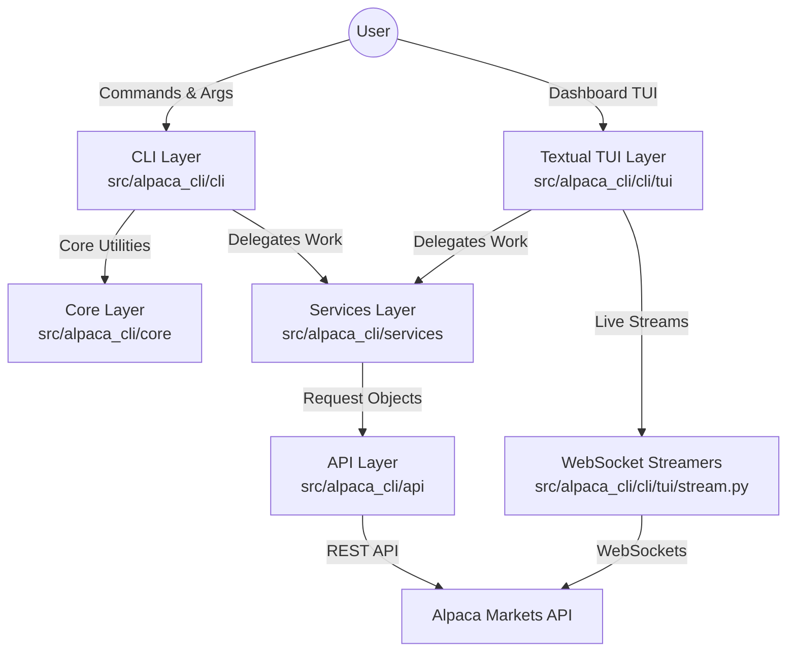

# Alpaca CLI — Project Documentation

## Project Overview
- **What this project is**: A command-line interface tool for the Alpaca Markets API.
- **Tech stack**: Python 3.14+, `alpaca-py` >= 0.43.2, `rich-click`, `Rich`, `Textual` >= 1.0.0.
- **Entry point**: `alpaca-cli` → `alpaca_cli.cli.main:cli`

## Architecture

### Module Responsibilities
- **`api/`**: Manages direct connections to Alpaca API through client singletons (`client.py`).
- **`services/`**: Contains pure Python business logic, financial math, and order builders independent of the CLI presentation layer (e.g., `portfolio.py`, `orders.py`).
- **`core/`**: Handles foundational logic including application configurations, credentials (`config.py`), constants (`constants.py`), and custom logging (`logger.py`).
- **`cli/`**: The presentation layer.
  - **`commands/`**: Organized Click command groups (`trading/`, `data/`, `portfolio.py`, `config.py`, `dashboard.py`).
  - **`tui/`**: Textual terminal workstation dashboard (`app.py`, `stream.py`).
  - **`formatters.py` & `theme.py`**: Rich console tables and color palettes.

## Textual TUI Workstation (`src/alpaca_cli/cli/tui/`)

### Architecture & Components
- **`app.py`**: `DashboardApp(App)` managing event loops, state, modals, hotkey bindings, and 5-tab workstation navigation.
- **`stream.py`**: `MarketStreamer` (`StockDataStream`) and `NewsStreamer` (`NewsDataStream`) running background WebSocket threads. Safely communicates ticks to UI via `app.call_from_thread()`.

### 5 Main Workstation Tabs
1. **Portfolio Tab**: 2x3 summary card grid (`Equity`, `Buying Power`, `Cash`, `Day P&L`, `Margin Maintenance`, `PDT Status`), 2-column split layout containing `Open Positions Table` (blue `[LONG]` / magenta `[SHORT]` badges) and `Asset Allocation Progress Bar Chart`.
2. **Markets Tab (Watchlist)**: Top Bloomberg horizontal marquee ticker tape (`SPY`, `QQQ`, `DIA`, `IWM`, `VIX`), 7-column data-dense `#markets_table` with **ASCII intraday sparklines (`▂▃▄▅▆▇█`)**, live tick cell updates via `table.update_cell()`, sector preset buttons (`+ Tech`, `+ Indices`, `+ Crypto`).
3. **Trade Tab**: Advanced 2-column order ticket supporting Market/Limit, Notional/Qty, TIF, and Price ($) / Percent (%) Take Profit & Stop Loss brackets with market snapshot price auto-fill.
4. **Orders Tab**: `#orders_table` listing open/active orders with 1-click `Cancel All Open Orders` action.
5. **Market News Tab**: Real-time breaking news feed, symbol search filter (`NVDA`, `AAPL`) with `Enter` key support, and `NewsReaderModal` for reading full un-truncated articles with a 1-click **"Trade Ticker"** action.

### Interactive Modal Screens
- **`PositionModal`**: Summary view of cost basis, unrealized PnL, and 1-click position liquidation (`client.close_position`).
- **`OrderInfoModal`**: Displays order details, TIF, limit prices, and 1-click order cancellation.
- **`AssetInfoModal`**: Displays Alpaca asset properties (tradable, shortable, marginable, easy to borrow) and 1-click watchlist removal.
- **`NewsReaderModal`**: Renders full article headline, author, source badge, publish date, un-truncated summary text, and 1-click ticket pre-fill into Trade tab.
- **`ActivityLogModal`**: Full-screen live execution drawer (triggered via `Ctrl+L`) logging timestamped order fills, cancellations, position liquidations, and WebSocket tick events with a 1-click **"Clear Log"** button.

### Speed Trading Hotkeys & Keybindings
- `Ctrl+B`: **Quick Buy** — Pre-fills the Trade tab order ticket with the highlighted symbol in Markets or Portfolio, then switches tabs instantly.
- `Ctrl+K`: **Quick Liquidate** — Opens liquidation modal for the highlighted position row in Portfolio tab.
- `Ctrl+R`: **Refresh All** — Reloads all account data, market quotes, active orders, and breaking news feeds across all tabs.
- `Ctrl+L`: **Activity Log Modal** — Pops up the hidden full-screen system event & order execution log drawer from anywhere in the app.
- `/` (Slash): **Search Focus** — Focuses the symbol input field on Markets tab or filter field on News tab.

## Configuration & Credentials
The application utilizes a cascading configuration priority:
1. **Environment Variables**: `APCA_API_KEY_ID`, `APCA_API_SECRET_KEY`, `APCA_ENDPOINT_URL`, `ALPACA_MODE`
2. **Configuration File**: Stored at `~/.alpaca.json` containing `paper` and `live` credentials.
3. **Runtime State**: Maintained at `~/.config/alpaca-cli/config.json`.

**Paper vs Live Mode Switching:**
The application distinguishes between paper (simulated) and live trading environments. The active mode dictates which set of credentials and endpoint URLs (e.g., `https://paper-api.alpaca.markets`) are utilized. The CLI explicitly displays the active mode in tabular outputs.

## Alpaca API Usage & SDK Cross-Reference
- **Client Singletons**: Managed via `AlpacaClient` and `AlpacaDataClient` which yield instances of `TradingClient`, `StockHistoricalDataClient`, and `CryptoHistoricalDataClient`.
- **TradingClient Usage**: Primarily used for `orders`, `positions`, `account`, `clock`, and `assets` commands.
- **StockHistoricalDataClient & CryptoHistoricalDataClient**: Fetch market data across `quotes`, `bars`, and `trades`.
- **SDK Request/Response Pattern**: The application encapsulates API parameters within Request objects before sending them via the client.
  - Example: `MarketOrderRequest(...)` → `client.submit_order(...)` → Returns `Order` object.
- **Official SDK Reference**: [https://alpaca.markets/sdks/python/](https://alpaca.markets/sdks/python/)

## Order System Design
- **Builder Pattern**: Functions within `orders.py` abstract the instantiation of order requests (e.g., `create_market_order`, `create_limit_order`, `create_stop_order`, `create_trailing_stop_order`).
- **Order Types Supported**: Market, Limit, Stop, Stop-Limit, Trailing Stop.
- **Bracket Orders**: Engineered via `_build_bracket_params`, combining a `TakeProfitRequest` and `StopLossRequest`.
- **Order Classes**: `simple` (entry only, default), `bracket` (entry with predefined exit), `oco` (One-Cancels-Other, typically exit only), `oto` (One-Triggers-Other).
- **Time In Force (TIF)**: Supported durations include `day`, `gtc`, `opg`, `cls`, `ioc`, `fok`.
- **Notional vs Qty**: Orders can specify dollar amounts (`notional`) or share counts (`qty`).
- **Extended Hours**: Permitted explicitly with limit orders and `day` TIF.
- **Fractional Shares**: Functionally supported through notional orders (TIF must be `day`).
- **Order Lifecycle**: `submit` → `accepted` → `partially_filled` → `filled` (alternatively `canceled`, `expired`, `rejected`).
- **Order Modification**: Handled via `ReplaceOrderRequest`, which logically cancels the antecedent order while substituting a new one.

## Short Selling
- **Mechanics**: Sending an `OrderSide.SELL` order without a pre-existing long position opens a short position.
- **Requirements**: Requires a margin account, an equity threshold of at least $2000, and shorting capabilities enabled within the account configuration.
- **Closing Shorts**: Executed via an `OrderSide.BUY` order to cover the position.
- **Safety Guards**: Implemented during portfolio rebalancing via the `--allow-short` flag and negative weight validation.
- **Portfolio Commands Integration**: Commands such as `take-profit-all`, `trailing-stop-all`, and `bracket-all` deliberately filter by position side to handle shorts intelligently.

## Portfolio Rebalancing
- **Target Weights Format**: Sourced from a JSON document, e.g., `{"AAPL": 0.5, "MSFT": 0.3, "CASH": 0.2}`.
- **Weight Validation**: Assures values are non-negative (unless explicitly overridden via `allow_short`) and sum closely to 1.0 (enforcing a 0.99 - 1.01 tolerance bound).
- **Automatic Cash Calculation**: If `"CASH"` is omitted from target weights, it is autonomously derived from the remaining subset.
- **Notional-Based Execution**: Utilizes absolute dollar values to insulate against price fluctuations occurring between order calculation and fill time.
- **Sell-First Sequencing**: Actively disposes of surplus positions first, awaits completion confirmations (`_wait_for_order_completion`), and solely thereafter initiates buys to prevent margin violations.
- **Pricing Fallback Logic**: Initially seeks quote midpoints, falling back to the latest bar close if the bid-ask spread surpasses a 1% threshold (`MAX_SPREAD_THRESHOLD`).
- **Market Status**: Adjudicates the market clock prior to initiating a rebalance, which can be bypassed using the `--force` flag.
- **Execution Context**: Defaults to a safe `--dry-run` paradigm unless explicitly toggled to execute.
- **Minimum Thresholds**: Implements dust threshold logic, demanding at least a $1.00 (`MIN_TRADE_VALUE_THRESHOLD`) delta for order generation.

## CLI Output & Theming
- **Console Foundation**: Leverages the `Rich` console utilizing a Solarized Dark color palette tailored for visual contrast.
- **Themed Components**: Employs bespoke table configurations via `create_table` and `create_kv_table`.
- **Output Formats**: Configurable to emit data as `table` (default), `json`, or `csv`.
- **Exporting**: Facilitates data serialization to files via the `--export` parameter.
- **Mode Indication**: Titles inject Paper/Live mode badges dynamically to contextually anchor the user.
- **Robust Logger**: Restricts outputs to 120-columns to ensure cohesive readability.

## Trading Logic — Known Issues & Guards
The following guards have been integrated into the system to circumvent known edge cases:
1. **Truthy vs None Checks**: Applied in bracket parameters and stop orders to avert errant boolean coercions.
2. **OCO Order Class Misuse**: Corrected behavioral misapplications inside `bracket-all` functions.
3. **Rebalance Short Selling Guard**: Actively blocks unintentional short initiations during rebalance events.
4. **Notional-Based Rebalancing**: Prevents mismatched executed values due to inter-order price shifts.
5. **Decimal Arithmetic**: Strictly adopted for financial calculus to nullify floating point imprecision.
6. **Dust Thresholds**: Filters out negligible delta values to mitigate excessive, immaterial api calls.
7. **Fractional Share Restrictions**: Hardened validation ensuring fractional logic is bound exclusively to valid TIF parameters.
8. **Pydantic NewsRequest Symbols String Validation**: Ensures `symbols` parameter is passed as a string (e.g. `"NVDA"`) rather than a Python list `["NVDA"]` to prevent `ValidationError` crashes.
9. **Rich Text Marquee Slicing**: Slices Rich `Text` spans directly (`full_text[offset:] + full_text[:offset]`) to preserve markup formatting across 150ms marquee shift frames.
10. **Order Ticket Snapshot Price Fallback**: Checks `latest_trade.price` first, falling back to `previous_daily_bar.close` if live ticks are missing outside market hours.

## Testing
- **Test Structure**: Resides entirely within the `tests/unit/` directory.
- **Key Test Files**:
  - `test_rebalancing.py` (18 tests focusing extensively on weighting algorithms and safety limits)
  - `test_trading_commands.py` (3 tests verifying command execution bindings)
  - `test_data_commands.py` (5 tests verifying market data extraction logic)
- **Fixtures Setup**: Standardized using `mock_config`, `mock_trading_client`, and varied sample objects (positions, weights, prices).
- **Run Command**: `uv run pytest tests/ -v`

## Quick Reference — CLI Commands

| Command | Description |
|---------|-------------|
| `alpaca-cli dashboard` | Launch Textual Terminal Workstation |
| `alpaca-cli trading account status` | Account overview |
| `alpaca-cli trading orders buy market AAPL 10` | Market buy |
| `alpaca-cli buy AAPL 10` | Quick buy alias |
| `alpaca-cli sell AAPL 10` | Quick sell alias |
| `alpaca-cli pos` | Show positions |
| `alpaca-cli status` | Account status |
| `alpaca-cli quote AAPL` | Get quote |
| `alpaca-cli clock` | Market clock |
